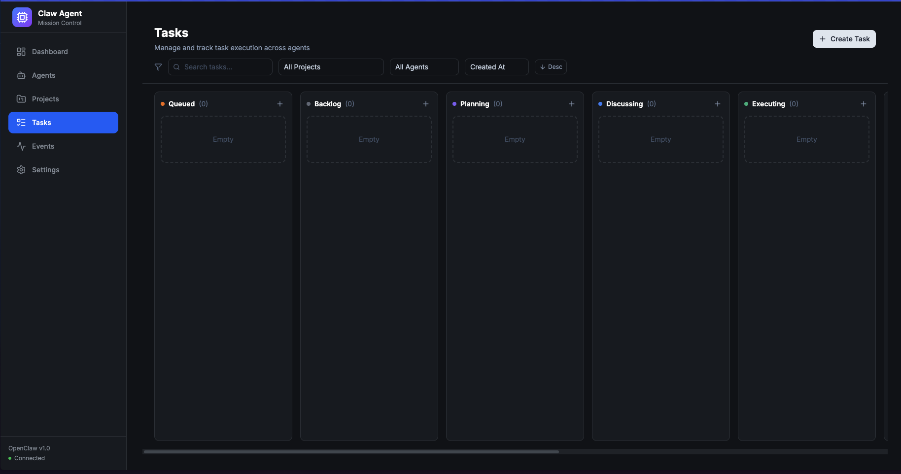
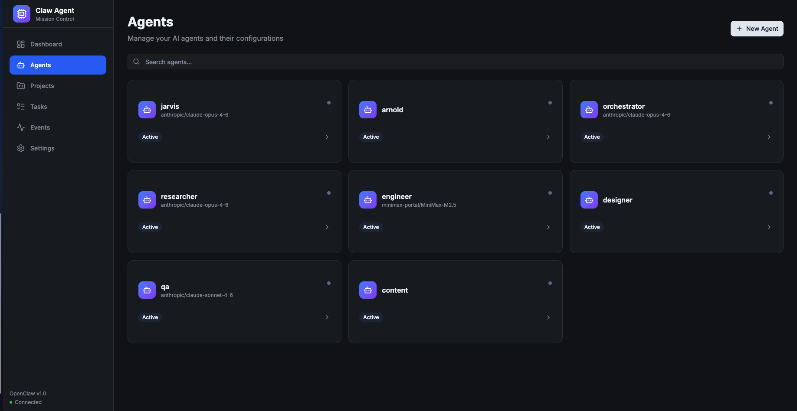
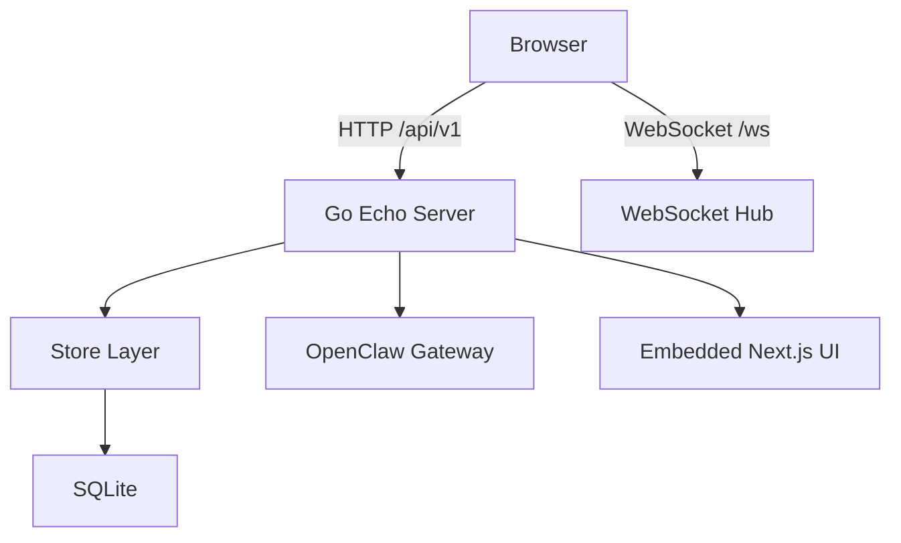

# Claw Agent Mission Control

Production dashboard for managing AI agents, orchestrating tasks, and tracking execution in real time through OpenClaw Gateway.

[](https://go.dev/)
[](https://nextjs.org/)
[](LICENSE)

## Overview

Claw Agent Mission Control combines a Go API server, an embedded Next.js UI, and a SQLite database into one deployable service. It helps teams create agents, assign and monitor tasks, orchestrate execution, and review outcomes with live updates.

The system supports two execution patterns:

- GSD for planning and orchestration
- Ralph Loop for iterative story execution

## Features

- Agent lifecycle management and identity file support
- Task board with planning/execution/review states
- Phase and story tracking for structured delivery
- Real-time WebSocket updates for events and progress
- Embedded UI in a single Go binary
- SQLite + sqlc for lightweight, type-safe persistence

## Demo Images

*Task management and agent orchestration interface*


*Agent and identity management view*


## Prerequisites

- Go `1.25.6` (or compatible `1.22+` runtime as documented)
- Node.js `20+`
- npm
- OpenClaw Gateway running and reachable

## Quick Start

1) Clone repository:

```bash
git clone https://github.com/abelkuruvilla/claw-agent-mission-control.git
cd claw-agent-mission-control
```

2) Configure environment:

```bash
cp .env.example .env
```

Set at least:

```env
OPENCLAW_GATEWAY_URL=ws://127.0.0.1:18789
OPENCLAW_GATEWAY_TOKEN=your-token-here
```

3) Build:

```bash
make build
```

4) Run:

```bash
./bin/mission-control
```

5) Open UI:

- `http://localhost:8080`

## Development

Install dependencies:

```bash
make deps
```

Start full development mode (UI + API hot reload):

```bash
make dev
```

Useful commands:

```bash
make dev-ui
make dev-api
make test
make lint
make fmt
```

Default dev ports:

- UI: `http://localhost:3000`
- API: `http://localhost:8080`

## Configuration

All runtime configuration is environment-based. See `.env.example` for complete options.

### Core

| Variable | Default | Purpose |
| --- | --- | --- |
| `HOST` | `0.0.0.0` | Bind address |
| `PORT` | `8080` | API/UI port |
| `ENV` | `development` | Runtime mode |
| `DATABASE_PATH` | `./data/mission-control.db` | SQLite database location |

### OpenClaw

| Variable | Required | Purpose |
| --- | --- | --- |
| `OPENCLAW_GATEWAY_URL` | Yes | OpenClaw WebSocket URL |
| `OPENCLAW_GATEWAY_TOKEN` | Yes | Gateway auth token |
| `OPENCLAW_CONFIG_PATH` | No | Optional config source for URL/token |

### Execution defaults

| Variable | Default | Purpose |
| --- | --- | --- |
| `DEFAULT_APPROACH` | `gsd` | Task approach |
| `DEFAULT_MODEL` | `anthropic/claude-sonnet-4-5` | Model selection |
| `MAX_PARALLEL_EXECUTIONS` | `3` | Concurrency limit |
| `GSD_DEPTH` | `standard` | GSD planning depth |
| `GSD_MODE` | `interactive` | GSD execution mode |
| `RALPH_MAX_ITERATIONS` | `10` | Story loop cap |
| `RALPH_AUTO_COMMIT` | `true` | Auto-commit behavior |

## Build and Deployment

### Local production build

```bash
make clean
make build
./bin/mission-control
```

### Docker

Build image:

```bash
make docker
```

Run with compose:

```bash
docker-compose up -d
```

### Background service helpers

```bash
make service-start
make service-status
make service-stop
```

## Architecture

High-level component flow:



Detailed architecture documentation:

- `docs/ARCHITECTURE.md`
- `docs/API.md`
- `docs/AGENT_INTEGRATION.md`

Note: transient QA and branch-work report files are not retained long-term. Their conclusions are summarized into the canonical docs above before PRs are opened.

## Project Structure

```text
cmd/
  server/             # Application entrypoint
internal/
  api/                # HTTP server, routes, handlers
  config/             # Env config loader
  db/                 # Migrations, sqlc queries/models
  executor/           # GSD / Ralph execution logic
  openclaw/           # Gateway integration
  queue/              # Task queue and watchdog
  store/              # Data access facade
  websocket/          # Real-time hub
ui/
  src/                # Next.js application code
docs/                 # Public documentation
mission-control-skill/# Agent skill package
```

## Security Notes for Public GitHub

- Never commit `.env` or raw credentials
- Keep local databases and sqlite journals out of git (`data/`, `*.db*`)
- Keep private keys/certs out of git (`*.key`, `*.pem`, `*.cert`, `*.p12`)
- Use `.env.example` as the only committed env template

## License

This project uses the MIT License. See `LICENSE`.
