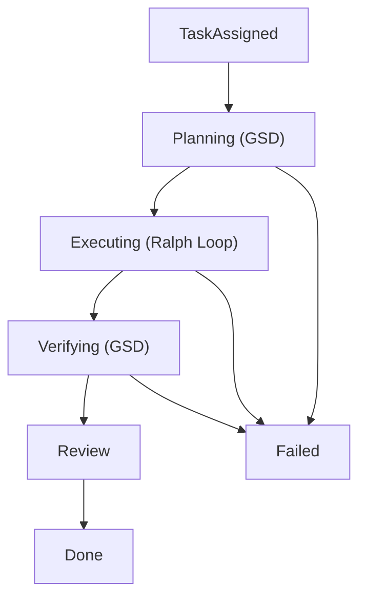

# Agent Integration Guide

This document consolidates the task instruction prefix, prompt prefix, and workflow pattern references.
Use it when integrating orchestrator agents with Mission Control.

## Purpose

Mission Control standardizes agent execution with two complementary protocols:

- **GSD** for planning and orchestration
- **Ralph Loop** for implementation and verification cycles

Use GSD to structure work. Use Ralph Loop to execute stories until completion.

## Protocol Summary

### GSD (planning)

Primary flow:

1. Research
2. Requirements
3. Roadmap
4. Stories
5. Delegation decisions

Expected planning artifacts:

- `PROJECT.md`
- `REQUIREMENTS.md`
- `ROADMAP.md`
- `STATE.md`

### Ralph Loop (execution)

Primary flow:

1. Pick next highest-priority incomplete story
2. Implement required changes
3. Run quality checks (tests/lint/type checks)
4. Mark pass/fail with evidence
5. Append learnings to `progress.txt`
6. Repeat until all stories pass or stop condition is reached

Execution principles:

- Keep stories small and independent
- Favor atomic commits
- Treat test pass as completion gate
- Persist memory in task artifacts/progress, not chat context

## Task Workflow



Recommended status transitions:

- `backlog` -> `planning` -> `discussing` -> `executing` -> `verifying` -> `review` -> `done`
- Use `failed` when blocked beyond recovery with clear reason logged

## API Endpoints for Agents

Base path: `/api/v1`

### Task and project context

- `GET /tasks/{task_id}?include=phases,stories`
- `GET /projects/{project_id}`
- `GET /projects/{project_id}/tasks`

### Agent discovery and selection

- `GET /agents` for roster and availability
- `GET /agents/{agent_id}` for identity and capability details

### Execution progress

- `PUT /tasks/{task_id}/status`
- `POST /tasks/{task_id}/progress-txt`
- `PUT /tasks/{task_id}` for deliverable markdown fields

### Phase and story reporting

- `GET /tasks/{task_id}/phases`
- `POST /phases/{phase_id}/progress`
- `POST /phases/{phase_id}/complete`
- `POST /phases/{phase_id}/fail`
- `GET /tasks/{task_id}/stories`
- `POST /stories/{story_id}/pass`
- `POST /stories/{story_id}/fail`

### Delegation

- `POST /agents/{agent_id}/sub-agents`
- `GET /tasks/{task_id}/subtasks`

For full payload shapes and response fields, see `docs/API.md`.

## Prompt Prefix Template

Use this block when assigning work to an agent:

```text
## Mission Control Integration

You are executing Task `{{TASK_ID}}`.
Use GSD for planning and Ralph Loop for execution.

API Base: `{{API_BASE}}/api/v1`

Planning (GSD):
- Research -> Requirements -> Roadmap -> Stories -> Delegation
- Maintain PROJECT.md, REQUIREMENTS.md, ROADMAP.md, STATE.md

Execution (Ralph Loop):
- Pick -> Implement -> Test -> Pass/Fail -> Learn -> Repeat
- Keep each story small and test-gated

Required API actions:
- Read task: GET /tasks/{{TASK_ID}}?include=phases,stories
- Update status: PUT /tasks/{{TASK_ID}}/status
- Log progress: POST /tasks/{{TASK_ID}}/progress-txt
- Report story outcomes: POST /stories/:id/pass or /stories/:id/fail
```

## Delegation Patterns

### Software project pattern

1. Orchestrator plans and decomposes
2. Delegate research subtask
3. Delegate design/spec subtask where needed
4. Delegate implementation subtask
5. Delegate QA/verification subtask
6. Merge outcomes, update state, complete parent task

### Content or marketing pattern

1. Research subtask
2. Writing/creation subtask
3. Review subtask
4. Parent task completion

### Hotfix pattern

1. Immediate execution status
2. Delegate fix subtask
3. Delegate verification subtask
4. Close once regression risk is addressed

## Delegation Decision Matrix

| Condition | Recommended action |
| --- | --- |
| Single-domain scoped task | Assign one specialist subtask |
| Multi-domain task | Split into domain-specific subtasks |
| Unknown scope | Research subtask first, then plan |
| Urgent known fix | Skip research and execute directly |
| Target agent busy | Queue task or pick alternate capable idle agent |
| Subtask failed | Read progress/error, re-scope, create follow-up subtask |
| No suitable specialist | Execute directly as orchestrator fallback |

## Operational Best Practices

- Update task status on every major transition
- Append progress regularly with timestamped notes
- Include changed files and decisions in progress entries
- Keep acceptance criteria explicit before execution
- Treat phase/story completion as API-reported state, not local-only state
- Use subtasks for parallelizable work to reduce context overload

## Minimal Checklist for Agent Runtimes

Before execution:

- Read task details with phases and stories
- Read project context when `project_id` exists
- Discover available agents if delegation is possible

During execution:

- Keep status accurate
- Write progress updates
- Pass/fail stories with concrete evidence

Before finalization:

- Validate acceptance criteria
- Run relevant tests/checks
- Move status to `review` or `done`
- Mark `failed` only with actionable recovery details

## Branch and PR Automation QA (Current State)

Current status: branch management and PR automation are partially implemented and not yet end-to-end complete.

### Implemented foundation

- Tasks schema/model/API include `git_branch`
- Manual `git_branch` editing exists in task modal flows
- Subtask UI can surface parent branch context

### Missing automation capabilities

- Auto-generate `git_branch` during task creation
- Inherit parent `git_branch` automatically for subtasks
- Show `git_branch` on task cards (not only detail modal)
- Per-project branch settings (`git_repo`, `branch_prefix`, related config)
- API/UI action to create GitHub PR through `gh pr create`

### QA verdict summary

- Branch/PR workflow is functionally incomplete
- Core blocker: no automatic branch creation + no PR creation integration
- As a result, full flow (create task -> branch created -> implement -> create PR) is not yet verifiable

### Prioritized remediation checklist

1. Add backend branch generation in task creation path (`task/<short-id>-<slug>`)
2. Add subtask branch inheritance from parent task
3. Surface branch label in task cards
4. Add project-level branch configuration fields + UI
5. Add `/api/v1/tasks/:id/create-pr` endpoint and UI action backed by `gh pr create`
