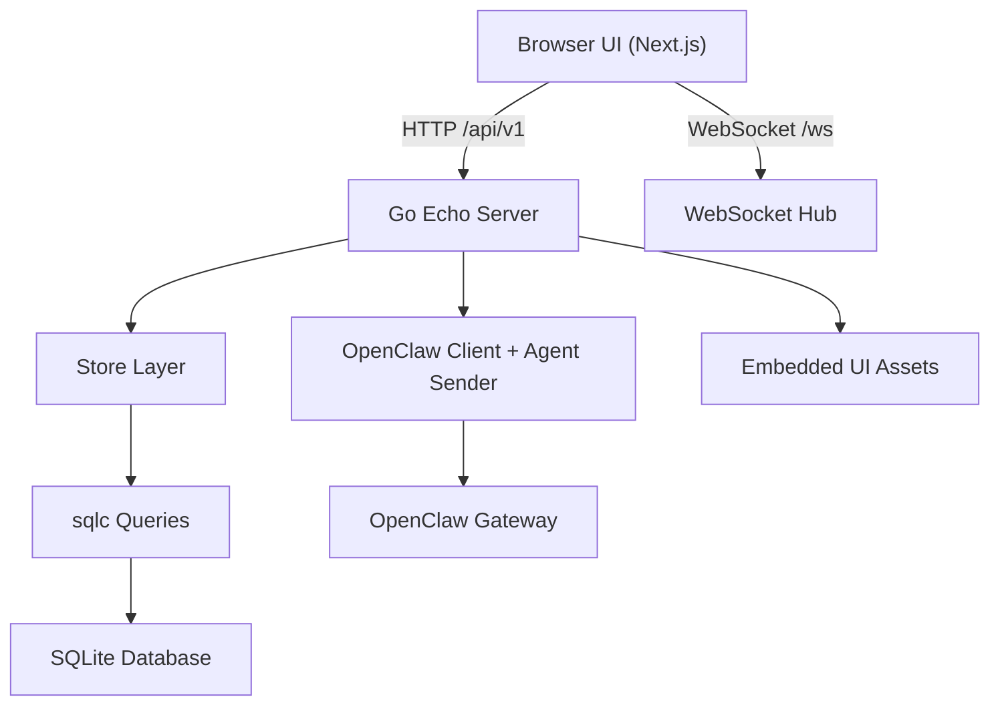
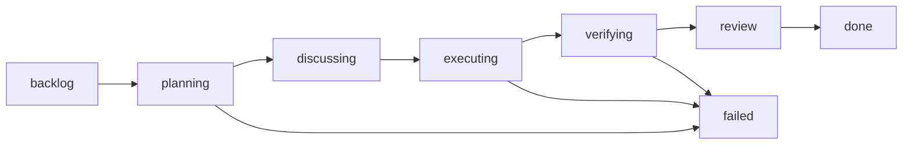

# Architecture

This document is the consolidated architecture reference for Claw Agent Mission Control.
It replaces long-form planning and design docs with an implementation-focused guide.

## System Overview

Mission Control is a single-binary Go application that serves:

- A REST API for agents, tasks, projects, phases, stories, comments, reporting, and settings
- A WebSocket endpoint for real-time updates
- A static Next.js UI embedded into the Go binary
- A SQLite database for persistent state

It integrates with OpenClaw Gateway for agent execution and messaging.

## High-Level Components

## Backend Architecture

### Entry and composition

- `cmd/server/main.go` wires configuration, database, store, API server, queue processor, and watchdog.
- `internal/api/server.go` composes handlers, middleware, routing, and SPA asset serving.
- `internal/config/config.go` loads environment configuration and defaults.

### HTTP and WebSocket layers

- Echo routes are grouped under `/api/v1`.
- REST handlers are in `internal/api/handlers/`.
- Real-time fanout is handled by `internal/websocket/hub.go` and exposed at `/ws`.

### Persistence and data access

- SQLite schema and migrations are in `internal/db/migrations/`.
- SQL query definitions are in `internal/db/queries/*.sql`.
- Generated query/model code is under `internal/db/*.sql.go` and `internal/db/models.go`.
- `internal/store/store.go` is the application data access facade used by handlers and executors.

### Execution engines

- `internal/executor/gsd.go`: planning-oriented orchestration flow
- `internal/executor/ralph.go`: story-by-story execution loop
- `internal/executor/orchestrator.go`: shared execution orchestration
- `internal/queue/processor.go`: queue processing and dispatch
- `internal/queue/watchdog.go`: stale task handling and retry/reset logic

### OpenClaw integration

- `internal/openclaw/client.go`: gateway client
- `internal/openclaw/agent_sender.go`: task and completion signaling to agents
- `internal/openclaw/agent_creator.go`: agent registration/bootstrap flow
- `internal/openclaw/config_reader.go`: reads OpenClaw model/token config where available

## Frontend Architecture

The UI lives in `ui/` (Next.js App Router + TypeScript + Tailwind + Zustand):

- `ui/src/app/`: top-level routes/pages (`agents`, `tasks`, `projects`, `events`, `settings`)
- `ui/src/components/`: reusable UI and domain components
- `ui/src/stores/`: Zustand stores for client-side state
- `ui/src/services/api.ts`: HTTP API layer
- `ui/src/hooks/useWebSocket.ts`: real-time subscription layer

Build output is exported to `ui/out` and copied to `internal/ui/assets` for embed at build time.

## Core Domain Model

Primary entities:

- **Agent**: orchestrator worker with identity docs and runtime status
- **Task**: unit of work, assignment, status, approach metadata, progress log
- **Phase**: high-level milestone for planning/verification lifecycle
- **Story**: atomic executable work item with pass/fail outcomes
- **Project**: grouping and context boundary for tasks
- **SubAgent**: delegated execution worker metadata
- **Event**: timeline records for task/agent updates
- **Comment**: discussion thread entries per task
- **Setting**: runtime defaults (gateway URL/token, model, execution settings)
- **ChatSession/ChatMessage**: agent conversation data

## Task Lifecycle

Typical execution behavior:

1. Task enters planning and is decomposed into phases/stories
2. Task moves to executing and stories are processed
3. Progress/events are appended and broadcast via WebSocket
4. Verification and review complete the lifecycle

## API Surface

Major route groups:

- `/api/v1/agents`
- `/api/v1/tasks`
- `/api/v1/projects`
- `/api/v1/phases`
- `/api/v1/stories`
- `/api/v1/events`
- `/api/v1/settings`
- `/api/v1/models`
- `/ws` (WebSocket)

See `docs/API.md` for endpoint-by-endpoint contracts and examples.

## Runtime and Deployment Model

### Development

- Frontend dev server (`next dev`) runs on `:3000`
- API server (Go with Air) runs on `:8080`
- Next config proxies API calls during development

### Production

- `make build` compiles UI and server into `bin/mission-control`
- Single process serves API, WebSocket, and embedded UI
- SQLite file defaults to `./data/mission-control.db`

### Containerized

- `Dockerfile` builds UI and Go binary in multi-stage build
- `docker-compose.yml` maps `8080:8080` and mounts `./data:/app/data`

## Configuration Boundaries

Configuration is environment-driven (`.env.example` is the canonical template):

- Server: `HOST`, `PORT`, `ENV`
- Storage: `DATABASE_PATH`
- Gateway: `OPENCLAW_GATEWAY_URL`, `OPENCLAW_GATEWAY_TOKEN`
- Execution defaults: model, approach, concurrency, GSD/Ralph settings

No production secrets should be committed. Use `.env` locally and keep it untracked.

## UI and Design Principles

The UI system is intentionally pragmatic:

- dark-first visual design
- componentized primitives under `ui/src/components/ui`
- route-level pages for domain workflows
- strong preference for predictable state transitions and clear status feedback
- responsive layout for desktop and tablet usage

This condenses the prior detailed design specification into implementation constraints.

## Quality and Reliability Notes

- Database migrations are versioned and committed
- sqlc keeps query contracts type-safe
- queue + watchdog reduce stuck-task risk
- WebSocket provides near real-time task/event visibility
- store layer centralizes transaction-safe data operations

## Extension Points

Common places to extend:

- Add API features: `internal/api/handlers/*` + route registration in `internal/api/server.go`
- Add schema/query features: migration + `internal/db/queries/*.sql` + sqlc generation
- Add UI features: `ui/src/app/*`, `ui/src/components/*`, and store/api hooks
- Add execution behavior: `internal/executor/*` and queue orchestration

## Related Documentation

- API contract: `docs/API.md`
- Agent task integration guide: `docs/AGENT_INTEGRATION.md`
- Contributor automation standards: `AGENTS.md`
